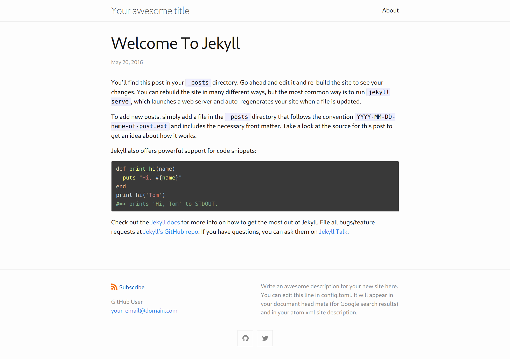

# zinima

A port of [Jekyll]'s [minima] theme to [Zola] with focus on being *accurate*.

## Differences

* no Google analytics
* no SEO tag
* code blocks are styled and highlighted natively by Zola
* support for [last.fm](https://last.fm) in social links

## License

 * Apache License, Version 2.0, ([LICENSE-APACHE](LICENSE-APACHE) or
   http://www.apache.org/licenses/LICENSE-2.0)
 * MIT License ([LICENSE-MIT](LICENSE-MIT) or
   http://opensource.org/licenses/MIT)

### Contribution

Unless you explicitly state otherwise, any contribution intentionally submitted
for inclusion in this document by you, as defined in the Apache-2.0 license,
shall be dual licensed as above, without any additional terms or conditions.

[Zola]: https://www.getzola.org/
[Jekyll]: https://jekyllrb.com/
[minima]: https://github.com/jekyll/minima
